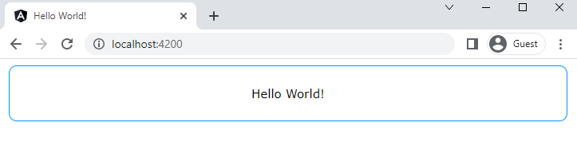
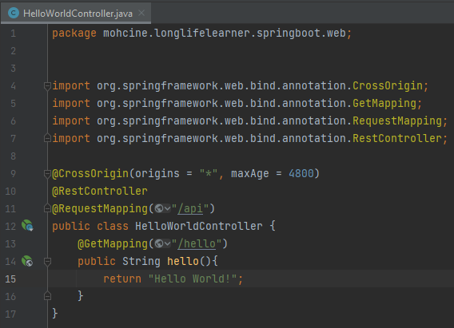
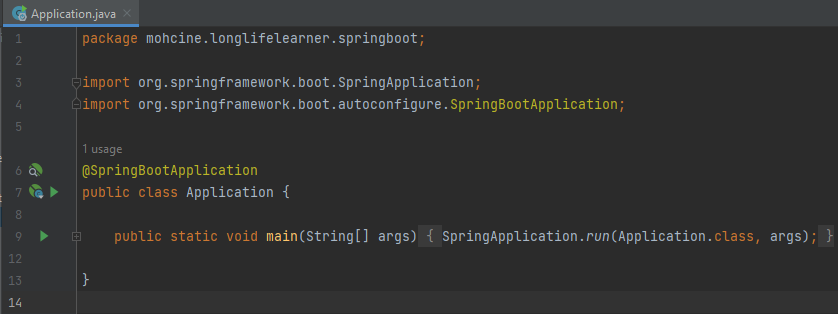
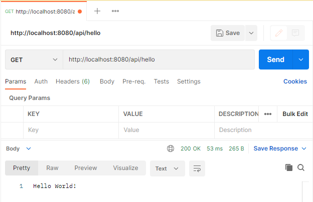
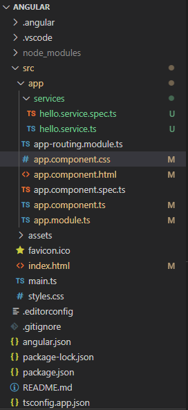
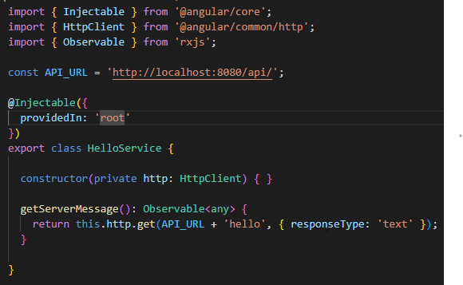
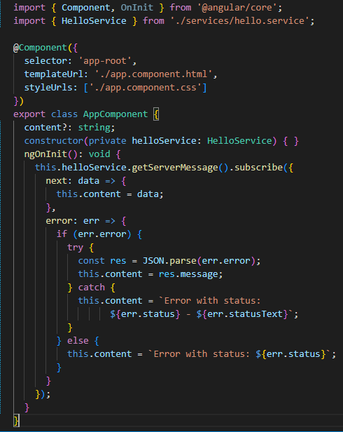
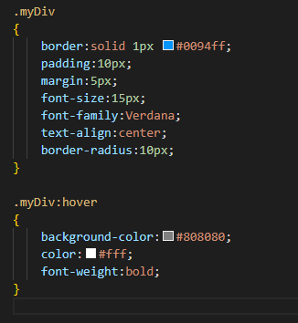
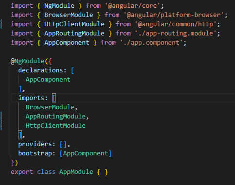

<h1>Angular + Spring Boot - Hello World<h1>
 

 
<h2>Step 1: spring boot web applicaion</h2>
<h5>HelloWorldController.java</h5>

<h5>Application.java</h5>

 
<h2>Step 2: Test the APIs using postman</h2>

 
<h2>Step 3: Frontend with Angular</h2>
<h5>Final Project Directory</h5>

<h5>hello.service.ts</h5>

<h5>app.component.ts</h5>

<h5>app.component.css</h5>

<h5>app.module.ts</h5>
